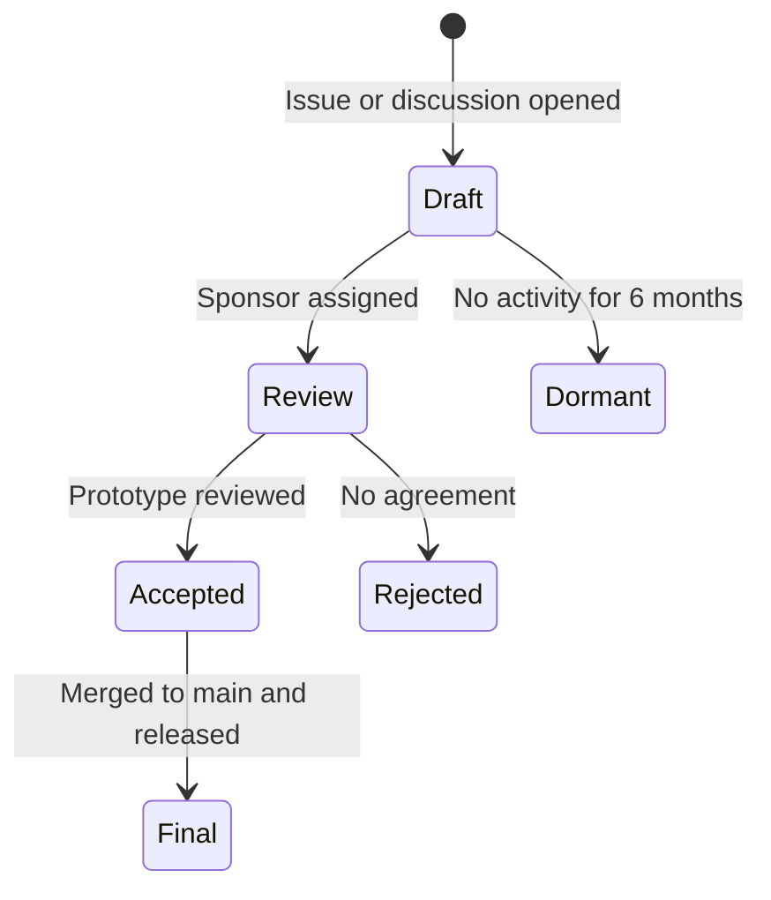

This page covers how to propose changes in `HarshShinde0/geocr_mcp`. There is no `seps/` tab in the docs and no `seps/` folder in the repo. Proposals live as GitHub issues, discussions, and pull requests. The `draft-sep` skill at `docs/.mintlify/skills/draft-sep/SKILL.md` lists the exact steps. Use it when your change touches `geocr:` terms, STAC mapping, or tool signatures.

## When a proposal is needed

Open a pull request directly without a separate proposal for small fixes. That includes bbox validation tweaks, docs edits, usage examples, a new public STAC catalog that keeps the same GeoCroissant schema, or a `mlcroissant` patch that does not change spec terms.

Write a proposal when the change would affect contracts outside the repo. That covers a new `geocr:` property such as `geocr:coordinateReferenceSystem` or `geocr:bandConfiguration`, a change to mapping in `src/geocr_mcp_server/eo.py:311` or `src/geocr_mcp_server/spec.py:69`, a new or breaking FastMCP tool signature in `src/geocr_mcp_server/tools.py`, or a change to CRS, bbox order `[min_lon, min_lat, max_lon, max_lat]`, or band wavelength units.

## Lifecycle

### 1. Draft

Open a GitHub issue or discussion that describes the idea. Add the type: Standards Track, Extensions Track, Informational, or Process. State whether it breaks existing GeoCroissant JSON-LD or `mlcroissant` loaders. Link any prior discussion and the prototype branch if one exists.

### 2. Review

A maintainer sponsors the idea and leads review on GitHub. The review checks `docs/community/design-principles.mdx`, `docs/development/roadmap.mdx`, and the touch points in `src/geocr_mcp_server/spec.py` and `src/geocr_mcp_server/eo.py`.

### 3. Accepted

The idea has agreement and a runnable prototype in `geocr_mcp`. Pseudocode alone does not count. The prototype must pass `pytest` and `mlcroissant` validation.

### 4. Final

Code lands in `main`, docs are updated, and the release notes tag the change. Rejected or dormant ideas stay archived as closed issues.

## What to put in the draft

- Title, author, date in `YYYY-MM-DD`, type, and status.
- Abstract and motivation with a concrete example of what is missing today.
- Exact JSON-LD, `geocr:` property types, and tool signatures. Include bbox order and `limit` ranges `1-50` where relevant.
- Rationale and alternatives you tried.
- Backward compatibility for existing GeoCroissant files and `mlcroissant` readers.
- Security notes for `contentUrl` schemes `s3://` and `https://`, the `GEOCR_OUTPUT_DIR` basename rule in `src/geocr_mcp_server/common.py:472`, and STAC request limits.

## How to file

Follow `docs/.mintlify/skills/draft-sep/SKILL.md` section 4. It creates `docs/proposals/{slug}.md` where `slug` is lowercase with hyphens and about 50 characters. After that you can open a draft pull request with `gh pr create --repo HarshShinde0/geocr_mcp --base main`. If you do not have a sponsor set `Sponsor: None` and tag 1 to 2 maintainers from `MAINTAINERS.md` on the pull request.
