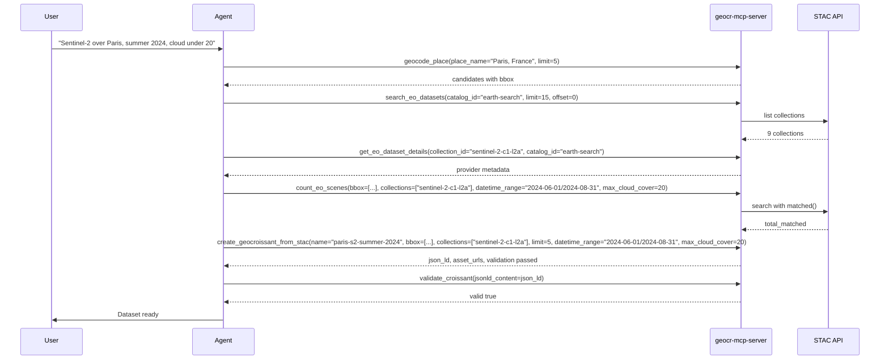

An agent chains GeoCroissant tools without human steps in between. The server does not have built-in routing; the model chooses the next tool.

## Workflow



Keep limits small. `create_geocroissant_from_stac` embeds scenes as inline records, so large `limit` values inflate the response. Use `count_eo_scenes` to decide, then generate with 5 to 10 scenes.

## Python agent with LangChain

```python
import asyncio
import json
from mcp import ClientSession, StdioServerParameters
from mcp.client.stdio import stdio_client
from langchain_mcp_adapters.tools import load_mcp_tools
from langchain_openai import ChatOpenAI
from langgraph.prebuilt import create_react_agent

async def run_agent():
    server_params = StdioServerParameters(
        command="uvx",
        args=["geocr-mcp-server"]
    )
    async with stdio_client(server_params) as (read, write):
        async with ClientSession(read, write) as session:
            await session.initialize()
            tools = await load_mcp_tools(session)
            model = ChatOpenAI(model="gpt-4o")
            agent = create_react_agent(model, tools)
            response = await agent.ainvoke({
                "messages": [("user", "Find Sentinel-2 scenes over Lake Tahoe for August 2023 with cloud under 10 and return the scene count.")]
            })
            print(response["messages"][-1].content)

if __name__ == "__main__":
    asyncio.run(run_agent())
```

The same pattern works with any framework that can call MCP tools. Always confirm collection ids with `search_eo_datasets` before searching scenes.
