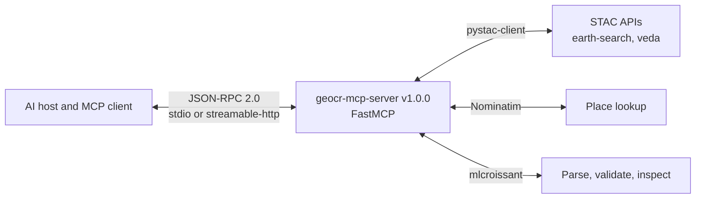

GeoCroissant MCP uses the Model Context Protocol host-client-server pattern. A FastMCP Python server sits between an AI client and two live STAC APIs.

## Topology

### 1. Host and client

Claude Desktop, Cursor, or any MCP host runs a client. The client starts the server as a subprocess for stdio or connects to an HTTP endpoint for streamable-http. The client handles the `initialize` handshake and then calls tools.

### 2. Server

`src/geocr_mcp_server/server.py` creates `FastMCP('geocr-mcp-server')` with 17 tools registered from `tools.py`. There are no resources or prompts. Transports are `stdio` locally and `streamable-http` in hosted mode; `sse` is also accepted as a flag for compatibility. The server sets transport security to allow any host when `PORT` or `RENDER` is set.

The modules are:

- `catalogs.py` reads `config/catalogs.yaml` and exposes `earth-search` (`https://earth-search.aws.element84.com/v1`) and `veda` (`https://openveda.cloud/api/stac`). The file lists 9 collections for earth-search and a long informational snapshot for veda; live discovery still hits the provider.
- `eo.py` does STAC work with `pystac-client`: `search_collections`, `get_collection_details`, `search_scenes`, `count_scenes`, `geocroissant_from_stac`.
- `geocoding.py` calls Nominatim for `geocode_place`.
- `spec.py` provides `official_context()` with prefixes `sc`, `cr`, `geocr`, `rai`, `dct`, `prov`, and builds scaffolds with conformance `http://mlcommons.org/croissant/1.1` and `http://mlcommons.org/croissant/geo/1.0`.
- `composition.py` runs independent STAC searches and composes one document with a separate RecordSet per source.
- `common.py` wraps `mlcroissant` for loading, validation, and summaries: `resolve_jsonld_input`, `load_dataset`, `summarize_metadata`, `summarize_distribution`, `get_structure_graph`.

### 3. Providers and validation

STAC APIs provide collections and items. The server translates tool arguments into `pystac_client.Client.search` calls with `bbox` as `[min_lon, min_lat, max_lon, max_lat]`, `datetime`, `query` for `eo:cloud_cover`, and `limit`. `mlcroissant` handles schema validation, structure graphs, and record materialization locally.

## Message lifecycle

1. Client sends `initialize` with capabilities. Server replies with name, version, and tool list.
2. Client calls `tools/list`. Server returns 17 tool definitions with JSON Schema inputs.
3. Client calls `tools/call` for one tool, for example `geocode_place` then `search_eo_datasets` then `create_geocroissant_from_stac`.
4. Server runs the underlying function, often in `asyncio.to_thread` because STAC and `mlcroissant` are synchronous, and returns a typed result.
5. For generation tools the result includes `json_ld`, `asset_urls`, and a `mlcroissant` validation report. Validation does not check whether remote asset URLs are reachable.
