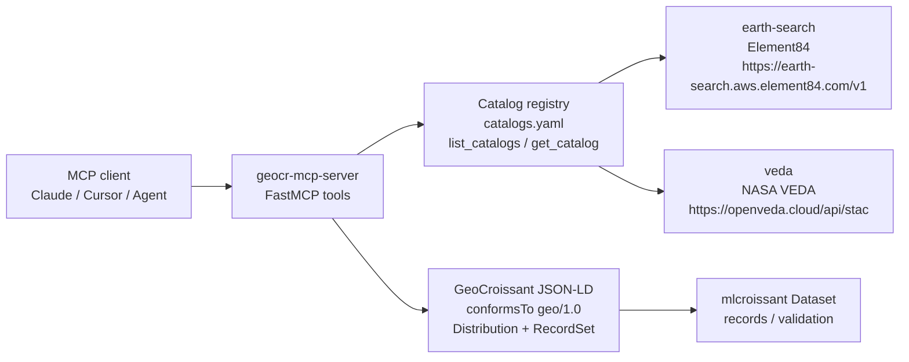

The GeoCroissant STAC Catalog Registry is the catalog layer inside geocr-mcp-server. It maps short catalog ids to live STAC API endpoints and keeps an informational snapshot of the collections you can discover through each endpoint. The registry has two entries today.

* earth-search - Earth Search (Element84 / AWS Open Data) at `https://earth-search.aws.element84.com/v1` with 9 collections
* veda - NASA VEDA at `https://openveda.cloud/api/stac` with more than 200 thematic collections

The config lives at `src/geocr_mcp_server/config/catalogs.yaml:1` and is shipped as package data. The loader in `src/geocr_mcp_server/catalogs.py:1` reads it on first access, caches it, and exposes `list_catalogs()` and `get_catalog()` to the tools layer. Set the environment variable `GEOCR_CATALOGS_CONFIG` to point at your own YAML file if you want to register different catalogs without changing code. Call `reload_config()` in `src/geocr_mcp_server/catalogs.py:89` to pick up changes after you replace the file.

## What the registry provides

* A single map from catalog id to base URL and description. This is what `list_eo_catalogs` returns.
* An informational `collections` list per catalog. This list is a snapshot, not the source of truth.
* A `default_catalog` value, currently `earth-search`, that the tools use when `catalog_id` is not provided.

The default is `earth-search` because it covers the most widely used open EO archive on AWS and it responds quickly for global queries. You can still target `veda` by passing `catalog_id: "veda"` to `search_eo_datasets`, `get_eo_dataset_details`, `count_eo_scenes`, and `search_eo_scenes`.

## Live discovery vs configured snapshot

The registry keeps two views of truth.

* Configured snapshot - the `collections` array in `src/geocr_mcp_server/config/catalogs.yaml:15`. For earth-search this was audited on 2026-08-23 against `GET https://earth-search.aws.element84.com/v1/collections` and it matches the nine collections that API returns: `sentinel-2-c1-l2a`, `sentinel-2-l2a`, `sentinel-2-l1c`, `sentinel-2-pre-c1-l2a`, `landsat-c2-l2`, `sentinel-1-grd`, `cop-dem-glo-30`, `cop-dem-glo-90`, and `naip`. For veda the snapshot is a long list of thematic collections curated by NASA.
* Live discovery - what `search_eo_datasets` actually shows. It calls `GET {catalog_url}/collections` with `limit` and `offset` and returns whatever the provider advertises right now. If a provider adds a new collection before the snapshot is refreshed, live discovery will show it first.

Tools treat live discovery as authoritative. The snapshot is documentation and a quick reference. It also powers `list_catalogs()` in `src/geocr_mcp_server/catalogs.py:107`, which reports `collection_discovery: "live"` and `configured_collection_count` so you can see which view you are looking at.

## Registry ecosystem

The registry sits between clients and STAC providers:

* STAC APIs host the data and collection metadata. geocr-mcp-server does not host raster assets. It queries providers and builds GeoCroissant metadata from their responses.
* geocr-mcp-server hosts the registry and the discovery tools. It validates config at load time in `src/geocr_mcp_server/catalogs.py:39`, normalizes ids to lowercase, and validates that each entry has a `url` and a unique collection list.
* MCP clients and downstream consumers call `list_eo_catalogs` and `search_eo_datasets`, inspect one collection with `get_eo_dataset_details`, then search scenes and generate GeoCroissant with `create_geocroissant_from_stac` or `create_geocroissant_from_stac_sources`. Downstream loaders such as `mlcroissant` can then read the resulting dataset.

## Trust and scope

The registry does not authenticate STAC catalogs. Both registered endpoints are public HTTPS APIs and require no API key for collection and item search. Private catalogs are supported by design: you can point `GEOCR_CATALOGS_CONFIG` at a YAML file that lists an internal STAC URL, and `get_catalog()` will return it. Asset access is separate from catalog access. Assets may require provider credentials based on their URI scheme, for example `s3://` with AWS credentials or `https://` with a bearer token. See the authentication page for details.

The registry is not intended for private MCP server publishing. It is a STAC catalog map for EO discovery inside geocr-mcp-server. If you need to host a private registry, fork the YAML file and distribute it with your deployment.
