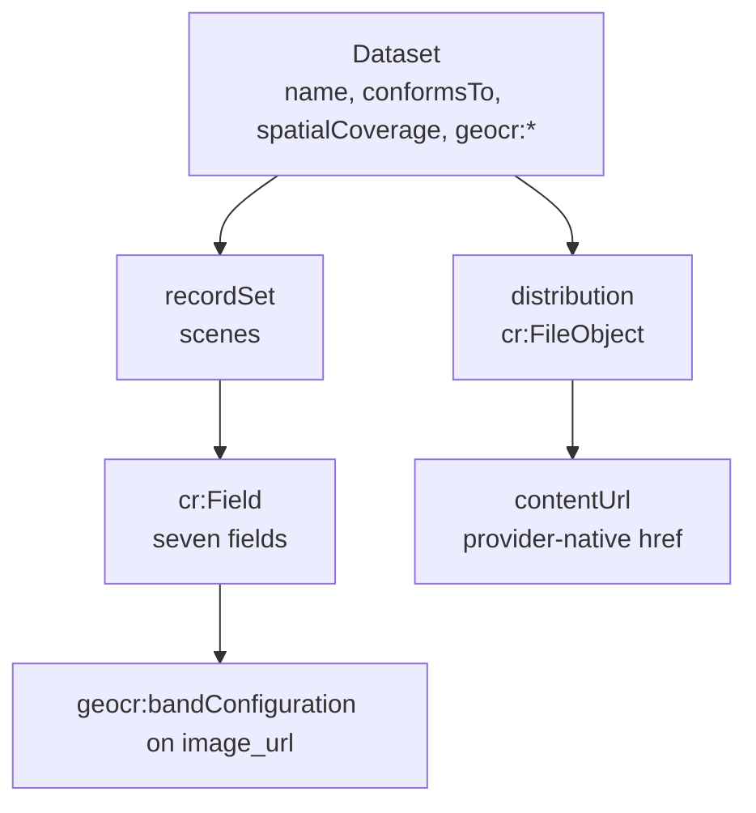

GeoCroissant extends the Croissant graph with geospatial properties. The code that builds and validates the graph is `src/geocr_mcp_server/spec.py:17` (`official_context()` and `build_scaffold`), `src/geocr_mcp_server/eo.py:311` (band mapping) and `src/geocr_mcp_server/common.py:60` (`load_dataset` and validation) with `mlcroissant`. The hosted endpoint is `https://geocr-mcp-server.onrender.com/mcp` and bbox input is `[min_lon, min_lat, max_lon, max_lat]`.

## Entity graph

## Dataset

The root is `@type: Dataset` with `@context` from `spec.official_context()`. `conformsTo` always has `http://mlcommons.org/croissant/1.1` and `http://mlcommons.org/croissant/geo/1.0`. Coverage is `spatialCoverage` as `Place` with `GeoShape` `box` in lat first order, and `temporalCoverage` as an interval string. Geo properties are `geocr:coordinateReferenceSystem`, `geocr:spatialResolution`, `geocr:temporalResolution`, `geocr:bandConfiguration`, `geocr:spectralBandMetadata`, `geocr:recordEndpoint` and RAI fields such as `geocr:spatialBias` and `rai:dataCollection`.

## Distribution

STAC-derived documents contain `cr:FileObject` entries only. Each entry keeps the provider `href` as `contentUrl` and the asset `type` as `encodingFormat`. No checksums are added because the source is a live dataset. `isLiveDataset` is `true`.

Scaffolds may contain `cr:FileSet` or `cr:FileObject` as declared in `build_scaffold`.

## RecordSet `scenes`

STAC results produce one RecordSet with `@id: scenes`, `key: scenes/scene_id` and seven fields: `scene_id`, `collection`, `datetime`, `cloud_cover`, `epsg`, `image_url`, `asset_urls`. Only `asset_urls` has `isArray: true`. Rows are inline in `data`, one row per scene. For multi-source composition the server creates one RecordSet per source and does not claim that bands or grids align.

## Validation graph

`mlcroissant` builds a graph with nodes `Metadata`, `FileObject`, `FileSet`, `RecordSet` and `Field`, and edges for containment, `source` and `references`. `get_structure_graph` returns that graph, and `inspect_geocroissant` returns the summarized metadata including `geocr:` and `rai:` values.
