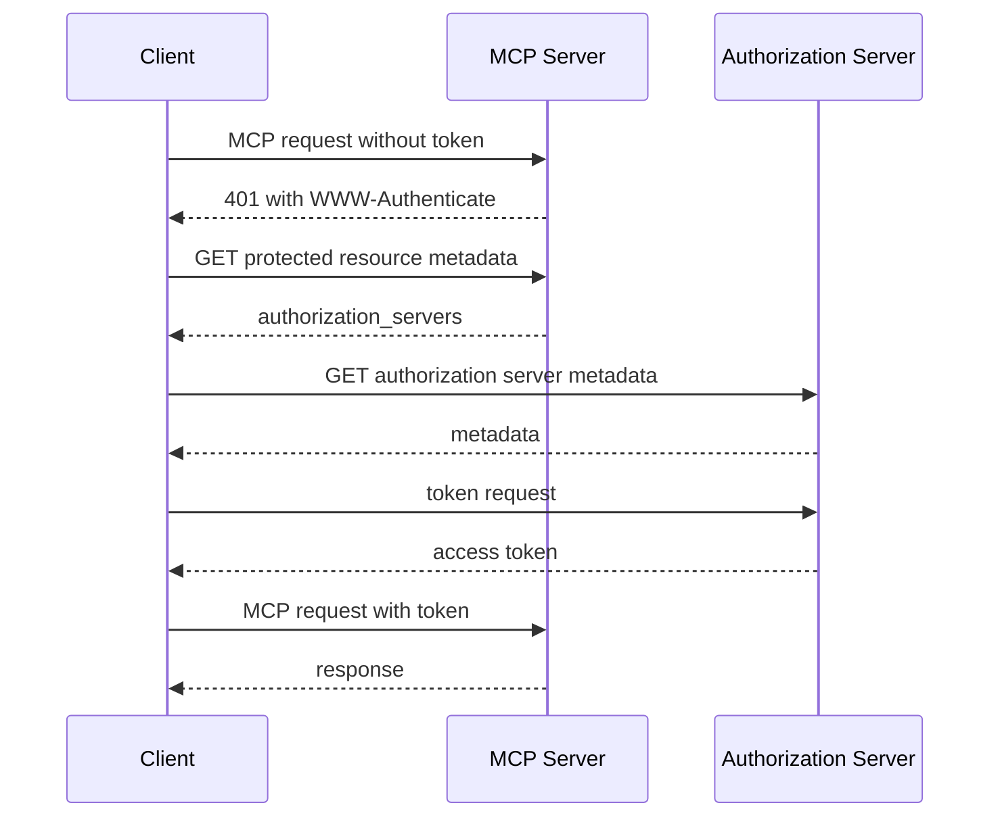

This page describes how a client finds the authorization server for an MCP server. It is MCP protocol reference. `geocr-mcp-server` does not require OAuth for `POST /mcp`.

## Protected resource metadata

Servers that require OAuth must implement OAuth 2.0 Protected Resource Metadata (RFC 9728) and include `authorization_servers` with at least one entry. When several servers are listed the client selects one per RFC 9728 section 7.6. Credentials are per authorization server and must not be reused across servers.

Clients must support both discovery paths:

1. `WWW-Authenticate` header with `resource_metadata` on a `401`.
2. Well known URI at `/.well-known/oauth-protected-resource` or `/.well-known/oauth-protected-resource/<path>`.

Clients must parse `WWW-Authenticate` and use it when present, otherwise probe the well known URIs.

## Authorization server metadata discovery

Clients discover authorization server metadata with the default `oauth-authorization-server` suffix. They try OAuth and OpenID Connect endpoints in order.

For an issuer with a path like `https://auth.example.com/tenant1`:

1. `https://auth.example.com/.well-known/oauth-authorization-server/tenant1`
2. `https://auth.example.com/.well-known/openid-configuration/tenant1`
3. `https://auth.example.com/tenant1/.well-known/openid-configuration`

For an issuer without a path like `https://auth.example.com`:

1. `https://auth.example.com/.well-known/oauth-authorization-server`
2. `https://auth.example.com/.well-known/openid-configuration`

Clients must validate that the `issuer` in the returned document matches the issuer used to build the URL, and must reject mismatched documents.

## Sequence

