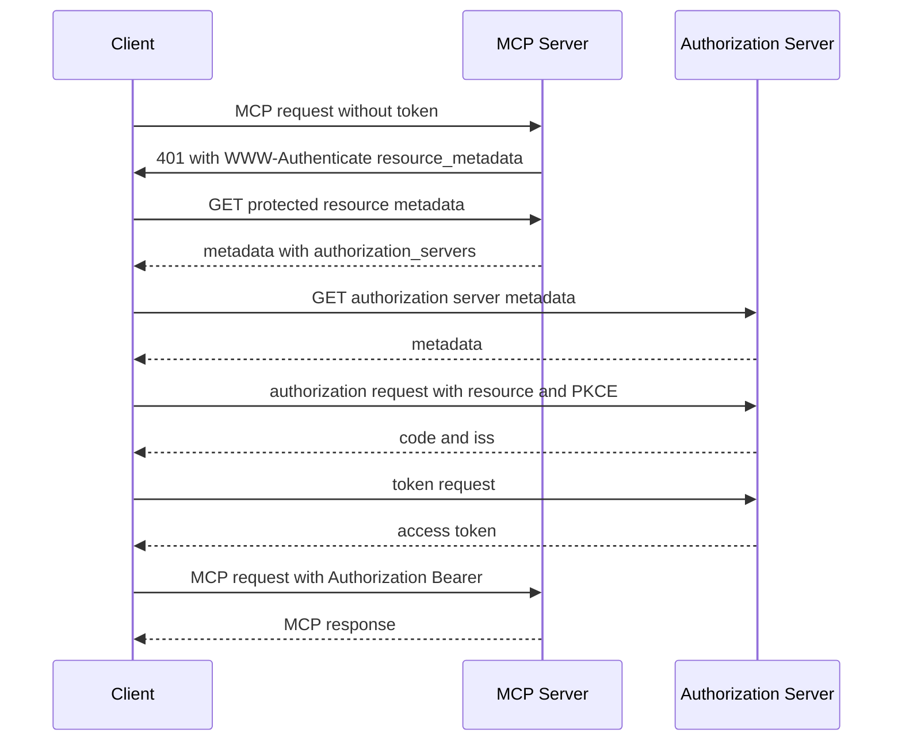

MCP authorization is optional. `geocr-mcp-server` does not implement OAuth and does not require a bearer token for `POST /mcp`. When the server runs behind a proxy that does require OAuth, the proxy enforces the flow described here.

## Scope

- HTTP transports may use the OAuth flow below.
- Stdio transports should not use it and should read credentials from the environment.
- Alternative transports must follow their own security best practices.

Standards used are OAuth 2.1, Bearer tokens, Authorization Server Metadata, Dynamic Client Registration, Resource Indicators, Protected Resource Metadata and Client ID Metadata Documents.

## Roles

- The MCP server is an OAuth resource server.
- The MCP client is an OAuth client.
- The authorization server issues tokens. It may be hosted with the resource server or separately.

## Overview

1. Authorization servers must implement OAuth 2.1.
2. Authorization servers and clients should support client ID metadata documents.
3. Clients may support dynamic client registration for backward compatibility.
4. Servers must implement protected resource metadata and clients must use it for discovery.
5. Authorization servers must provide either OAuth 2.0 Authorization Server Metadata or OpenID Connect Discovery.

## Discovery and registration

Servers advertise authorization servers through protected resource metadata. Clients select one per RFC 9728. Before the flow starts clients obtain a client id via client ID metadata documents, pre-registration or dynamic client registration.

## Scope selection

Servers may include `scope` in the `WWW-Authenticate` header. Clients should use that scope first, then fall back to `scopes_supported` from protected resource metadata. Servers should send all required scopes together so the client can request them in one round trip.

## Flow

## Token use

Clients must send `Authorization: Bearer <token>` and must not put tokens in the URI. Servers must validate audience per RFC 8707 and reject tokens not issued for them with `401`. Refresh token handling and error codes `401`, `403`, `400` follow OAuth 2.1.

For `geocr-mcp-server` itself, no token is required and no `WWW-Authenticate` challenge is sent. The flow above applies only when a fronting authorization server is present.
