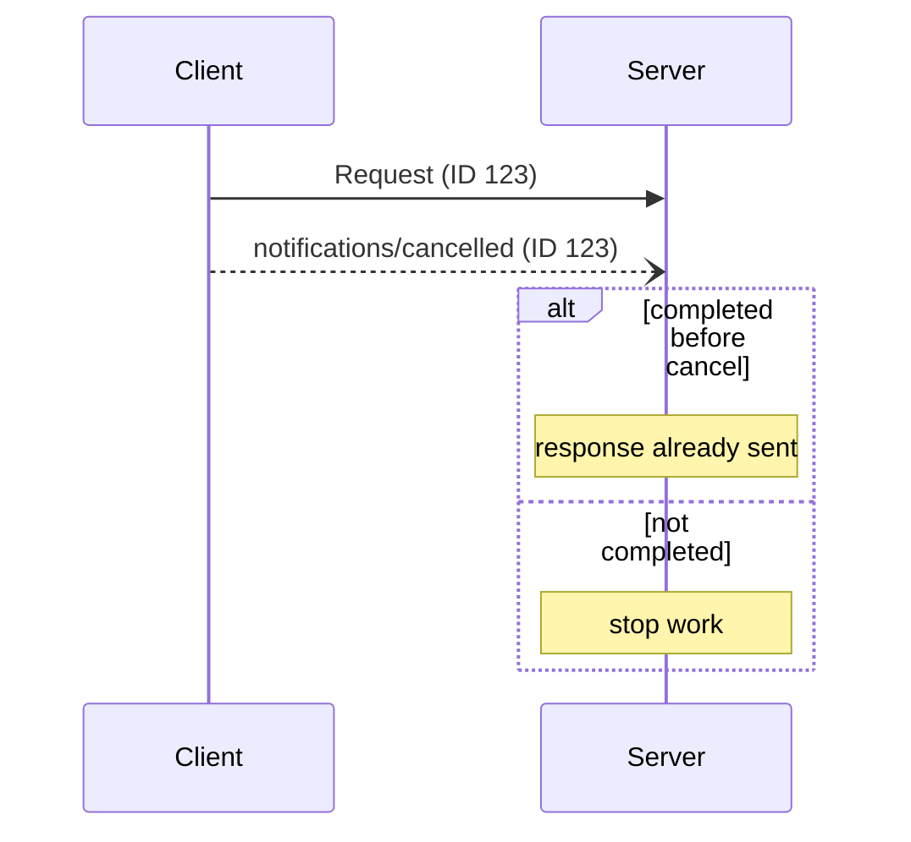

<div id="enable-section-numbers" />

MCP protocol reference. `geocr-mcp-server` uses this pattern for `stdio` and for `streamable-http` at `https://geocr-mcp-server.onrender.com/mcp`. Clients may cancel in flight requests.

## Cancellation flow

The client sends `notifications/cancelled` with the request id and an optional reason:

```json
{
  "jsonrpc": "2.0",
  "method": "notifications/cancelled",
  "params": { "requestId": "123", "reason": "User requested cancellation" }
}
```

Only the client sends this, except that the server sends it to end a `subscriptions/listen` stream.

## Transport specific cancellation

- Streamable HTTP: closing the SSE response stream is cancellation. No `notifications/cancelled` is sent.
- Stdio: the client must send `notifications/cancelled` because there is no per request stream to close.

## Timeouts

Implementations should set timeouts and cancel when a response does not arrive in time. SDKs should allow per request timeout configuration. Progress notifications may reset the timeout clock, but a maximum timeout should still apply.

## Behavior

- Clients should only cancel requests they issued and that are still in progress.
- Servers that receive a cancellation should stop work, free resources and not send a response. They may ignore unknown or already completed ids.
- Clients should ignore a response that arrives after cancellation.

## Timing

Network delay can cause cancellation to arrive after the server has already responded. Both sides must handle this race gracefully.


