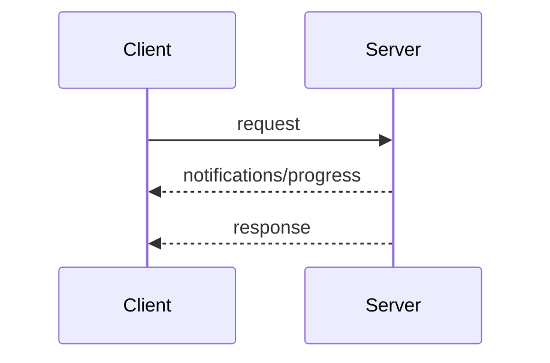

This page defines the MCP message patterns for `geocr-mcp-server` at `https://geocr-mcp-server.onrender.com/mcp`. Each transport (`stdio` and `streamable-http`) carries them without change.

Every interaction starts with the client:

- The client sends requests and notifications.
- The server replies with a response for each request, optionally preceded by request scoped notifications.

Servers must not initiate requests. Server to client input uses the MRTR pattern.

## Request and response

The client sends a request and the server replies with a result or error. While the request is in flight the server may send `notifications/progress` and `notifications/message`.

## Multi round-trip requests

When the server needs extra input it replies with `InputRequiredResult` and the client retries with `inputResponses`. See [Multi round-trip requests](/specification/2026-08-31/basic/patterns/mrtr).

## Subscribe and notify

The client sends `subscriptions/listen` to open a long lived notification stream. The server replies with `notifications/subscriptions/acknowledged` and then delivers the requested notification types. See [Subscriptions](/specification/2026-08-31/basic/patterns/subscriptions).

## Adding patterns

New features are built from these patterns. A revision that adds a pattern defines it here. Transports carry new patterns without change.
