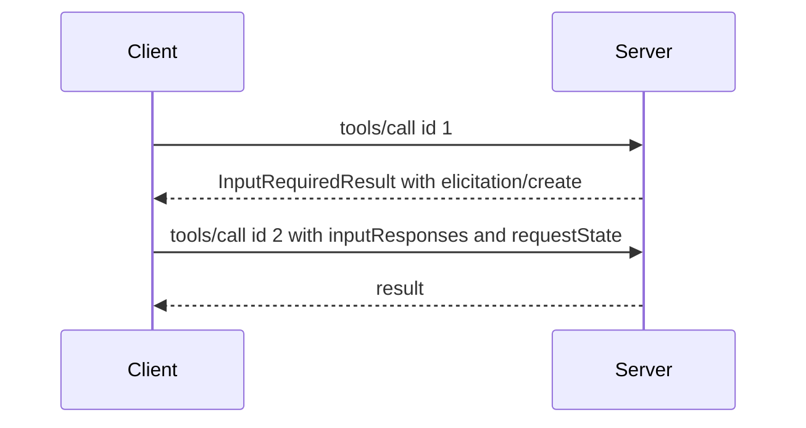

MCP protocol reference. This pattern replaces server initiated requests. Servers must use it for elicitation, sampling and roots.

## Overview

1. Client sends a request such as `tools/call`.
2. Server needs extra input and replies with `InputRequiredResult` that contains `inputRequests` and optional `requestState`.
3. Client gathers the input and retries the same method with `inputResponses` and the echoed `requestState`.
4. Server verifies state and returns the final result.

`geocr-mcp-server` does not send `InputRequiredResult` today. It completes tool calls without extra input. This page is kept as protocol reference.

## Core types

### InputRequests

A map where keys are server assigned ids and values are request objects such as `elicitation/create`, `sampling/createMessage` or `roots/list`.

### InputResponses

A map where keys match `InputRequests` and values are the client results for each entry.

### InputRequiredResult

A result with `resultType: input_required`, optional `inputRequests` and optional `requestState` which is opaque to the client. The client must echo `requestState` unchanged.

## Supported requests

Servers may return `InputRequiredResult` for `prompts/get`, `resources/read` and `tools/call` only.

## Server requirements

- Keys in `inputRequests` must be unique per response.
- Values must be of a type the client supports per its capabilities.
- At least one of `inputRequests` or `requestState` must be present.
- If `requestState` controls access, the server must protect its integrity with HMAC or AEAD, include the principal, an expiry and a digest of the original request, and reject tampered state.

## Client requirements

- If `inputRequests` is present the client must collect the inputs before retry. If absent it may retry immediately.
- The client must echo `requestState` exactly when present and must not include it when absent.
- The retry must use a new JSON-RPC `id`.

## Error handling

Servers should validate `InputResponses` and return a JSON-RPC error for malformed data, or send a new `InputRequiredResult` when required fields are still missing.
