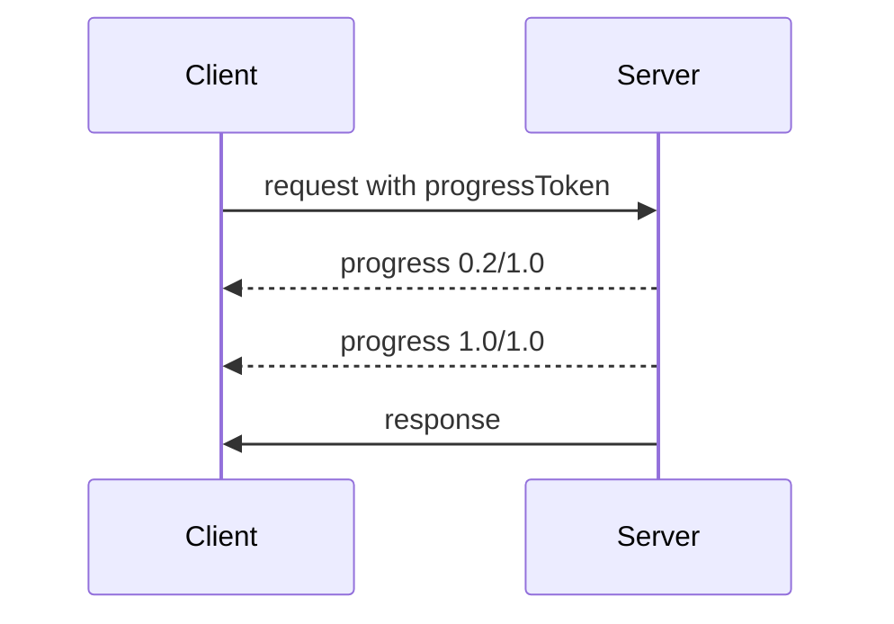

<div id="enable-section-numbers" />

MCP protocol reference. `geocr-mcp-server` does not send `notifications/progress` for GeoCroissant generation today, but clients may still request it with `progressToken`. Servers may send progress notifications for long running operations.

## Progress flow

The client includes `progressToken` in `_meta` to ask for progress. The token must be a string or integer and must be unique across active requests.

```json
{
  "jsonrpc": "2.0",
  "id": 1,
  "method": "some_method",
  "params": { "_meta": { "progressToken": "abc123" } }
}
```

The server may then send `notifications/progress` with `progressToken`, numeric `progress`, optional `total` and optional `message`.

```json
{
  "jsonrpc": "2.0",
  "method": "notifications/progress",
  "params": { "progressToken": "abc123", "progress": 50, "total": 100, "message": "Indexed 50 of 100 scenes" }
}
```

`progress` must increase. `progress` and `total` may be floating point. Progress stops after the final response.

## Behavior

- Servers may ignore a progress token or send updates at any frequency.
- Notifications must refer to an active token.


