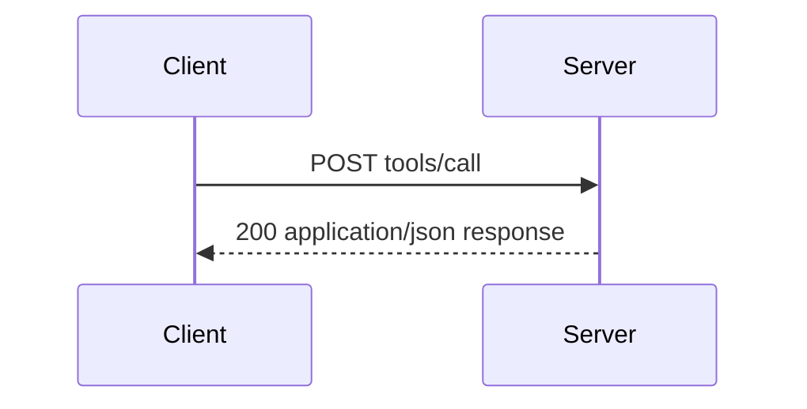
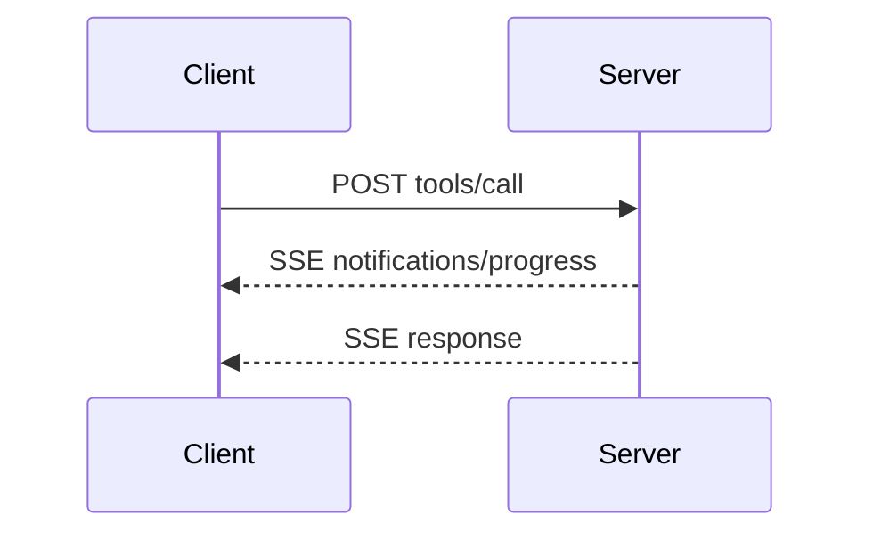

Streamable HTTP is the HTTP binding for `geocr-mcp-server`. The server exposes a single endpoint `POST /mcp`. Each tool call is one POST. The legacy `GET /sse` endpoint does not exist.

<Info>
`geocr-mcp-server` selects this transport when `PORT` or `RENDER` is set, or when `--transport streamable-http` is passed. It binds to `0.0.0.0` in cloud mode and to `127.0.0.1` locally.
</Info>

## Endpoint

- Path is `/mcp`, for example `https://geocr-mcp-server.onrender.com/mcp` with a health check at `GET /`. Local development uses `http://localhost:8000/mcp`.
- The client sends every JSON-RPC request or notification as a POST to `/mcp`.
- The server replies with `application/json` for a single response or `text/event-stream` for a streamed response that carries request scoped notifications and the final response.
- There is no GET stream endpoint and no session id.

## Security and endpoint

1. Servers must validate the `Origin` header and return `403` when it is invalid.
2. Local servers should bind to `127.0.0.1` instead of `0.0.0.0`.
3. Servers should require authentication when deployed publicly.

Without these checks a remote site could use DNS rebinding to talk to a local server.

## Sending messages

1. The client must use POST to `/mcp`.
2. The client must send `Accept: application/json, text/event-stream`.
3. The client must send `MCP-Protocol-Version: 2026-08-31`, `Mcp-Method` and `Mcp-Name` where required.
4. The body must be one JSON-RPC request or notification. The client must not send a response.
5. A notification that the server accepts returns `202 Accepted` with no body. A rejected notification returns an HTTP error, optionally with a JSON-RPC error that has no `id`.
6. A request returns `application/json` or `text/event-stream`. The client must support both.

## Receiving messages

- On an SSE stream the server may send `notifications/progress` and `notifications/message` before the final response. Those notifications relate to the originating request.
- The server must not send independent requests on the stream. Server to client input is returned as `InputRequiredResult` and the client retries the original method per [MRTR](/specification/2026-08-31/basic/patterns/mrtr).
- A `subscriptions/listen` request returns a long lived SSE stream that carries only the notification types the client asked for.
- Servers should send `X-Accel-Buffering: no` so proxies do not buffer SSE.
- `Last-Event-ID` is ignored. Streams are not resumable.

## Message flow

**Simple request:**

**Streamed request:**

## Cancellation

Closing the SSE response stream is cancellation. The server should stop work and must not send further messages for that request.

## Request metadata

Every POST must carry `MCP-Protocol-Version` that matches `_meta.io.modelcontextprotocol/protocolVersion`. A mismatch returns `400 Bad Request` with `HeaderMismatch`. Standard headers are `Mcp-Method` and `Mcp-Name`. For `tools/call` with `x-mcp-header` parameters the client also sends `Mcp-Param-{Name}` headers with base64 sentinel encoding when needed.

## Backward compatibility

Versions `2025-03-26` through `2025-11-25` used session headers `Mcp-Session-Id`, `DELETE` for session end and `GET` streams. This revision does not. A server that receives `Mcp-Session-Id` or `Last-Event-ID` ignores it. A `GET` or `DELETE` to `/mcp` returns `405 Method Not Allowed`. The deprecated HTTP+SSE transport (`GET /sse` then `POST /messages`) is not supported.
